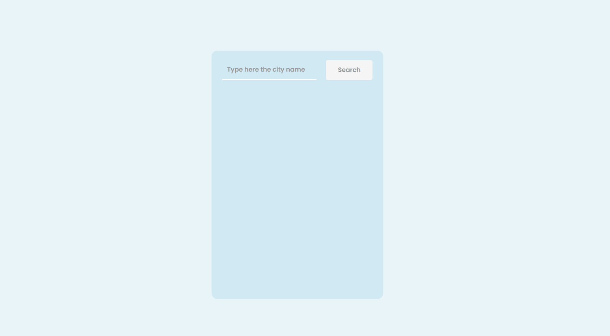
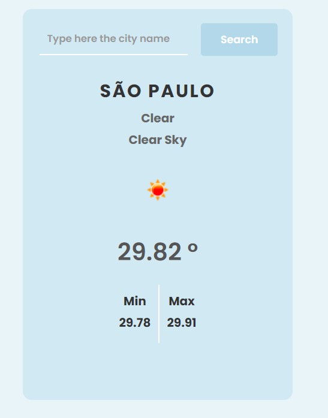

<h1 align="center">Weather Application</h1>

  <a href="#-tecnologias">Tecnologias</a>&nbsp;&nbsp;&nbsp;|&nbsp;&nbsp;&nbsp;
  <a href="#-projeto">Projeto</a>&nbsp;&nbsp;&nbsp;|&nbsp;&nbsp;&nbsp;

 

Você pode visualizar projeto completo através [DESSE LINK](https://sarahvjustino.github.io/weather-app/)

## 🚀 Tecnologias

Esse projeto foi desenvolvido com as seguintes tecnologias:

- HTML  
- SCSS
- JavaScript
- Git e Github

## 💻 Projeto

O projeto é uma aplicação que permite aos usuários obter informações meteorológicas em tempo real. A aplicação consome a API OpenWeatherMap para fornecer dados precisos e atualizados sobre as condições climáticas de uma determinada localização.
